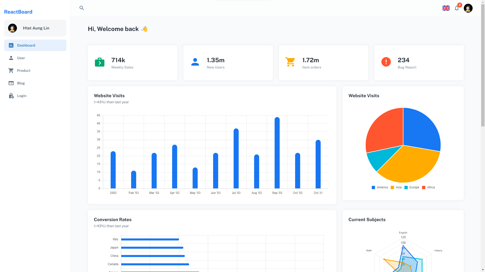

# ReactBoard

ReactBoard is a project developed for the purpose of practicing Material-UI.

## Technologies Used

- React
- TypeScript
- Material-UI
- MUI X Data Grid
- Chart.js

## Installation

1. Clone the repository.

   ```bash
   git clone https://github.com/your-username/your-project.git
   cd your-project
   npm install
   ```

## Usage

2. To run the development server, use the following command:

```bash
npm run dev
```

## ScreenShot



## Live URL

- [htl-react-board](https://htl-react-board.netlify.app/)
